# Database ER Diagrams

Generated from PostgreSQL schema metadata.

## Overview

[SVG](./overview.svg) · [Mermaid source](./overview.mmd) · [Graph metadata](./graph.json)

Primary tables belong to exactly one group. Context tables are additional one-hop neighbors.
Inferred relations use dashed lines unless the FK columns are part of the child primary key.
Composite UNIQUE annotations mark membership, not individual column uniqueness.

## Subgraphs

### community-1 — public.products

Hub: public.products

Primary tables: 3 · Context tables: 1

[SVG](./01-products.svg) · [Mermaid source](./01-products.mmd)

Tables: public.categories, public.inventory, public.products

Context: public.order&#95;items

### community-2 — public.orders

Hub: public.orders

Primary tables: 4 · Context tables: 1

[SVG](./02-orders.svg) · [Mermaid source](./02-orders.mmd)

Tables: public.customers, public.order&#95;items, public.orders, public.payments

Context: public.products
