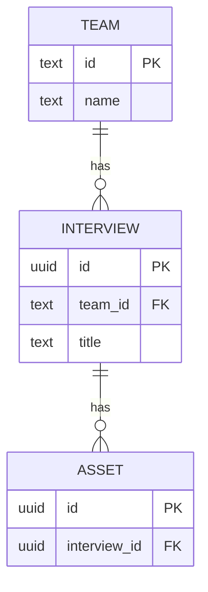
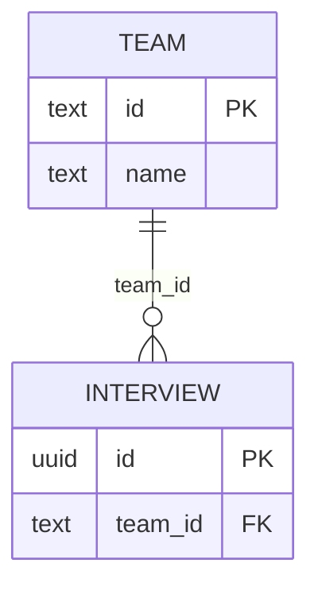

# PostgreSQL ER Diagram Decomposition CLI — Implementation Handoff

## 1. 背景

100テーブル前後の PostgreSQL データベースについて、全テーブルを1枚のER図にすると可読性が大きく落ちる。

当初は「最小数の頂点を削除してグラフを分割する minimum vertex cut」を検討したが、今回の目的には適さない。

理由:

- 端のノードや単なる articulation point を削除するだけでもグラフは簡単に分断できる
- 「最小カット」は、人間にとって意味のある業務ドメイン・関心領域の分割と一致しない
- 今回ほしいのは厳密な graph partition ではなく、「ER図として読みやすい部分グラフ」

そのため、方針を以下に変更する。

> PostgreSQL の実スキーマを直接 introspection し、テーブルをノード、FKをエッジとするグラフを構築する。  
> Community detection と centrality を使って自然なクラスタを求め、ER図向けのヒューリスティックを適用した上で、複数の Mermaid ER diagrams として出力する。

Drizzle ORM の `schema.ts` 自体は解析しない。

理由:

- Drizzle は schema 定義ファイルを複数ファイルに分割できる
- import / re-export / factory / helper 等を考えると静的な TypeScript AST 解析は面倒
- Drizzle の内部 API に依存する必要もない
- ER図として本当に描きたいのは「実際に PostgreSQL に適用されているスキーマ」
- DB introspection にすれば Drizzle / Prisma / 手書きSQL等にも依存しない

---

# 2. ゴール

CLI を実装する。

想定コマンド:

```bash
erd \
  --database-url "$DATABASE_URL" \
  --schema public \
  --max-tables 15 \
  --out ./docs/erd
```

または package 名次第で:

```bash
pnpm erd ...
```

出力例:

```text
docs/erd/
├── index.md
├── overview.mmd
├── 01-community.mmd
├── 02-community.mmd
├── 03-community.mmd
└── graph.json
```

最低限、以下を満たすこと。

1. PostgreSQL からテーブル・カラム・PK・FK・UNIQUE・NULL制約を取得
2. テーブルをノード、FKをエッジとする graph を生成
3. graph を複数の community / subgraph に分割
4. 各 subgraph の hub table を決定
5. 必要に応じて境界テーブルを隣接 subgraph に重複掲載
6. 1図あたりの最大テーブル数を制御
7. Mermaid `erDiagram` を複数生成
8. 全体俯瞰用の overview も生成
9. graph の中間表現を JSON として保存

---

# 3. 非ゴール

初期バージョンでは以下は不要。

- Drizzle `schema.ts` の AST 解析
- migration ファイルの解析
- SQL migration と DB schema の差分検出
- ER図のピクセル単位のレイアウト最適化
- DB内の行データ解析
- FKが存在しない「論理的リレーション」の推測
- LLMを使ったドメイン分類
- Web UI
- interactive graph viewer

将来的に追加してもよいが、v1では避ける。

---

# 4. 設計思想

処理パイプライン:

```text
PostgreSQL
   ↓
Schema Introspection
   ↓
SchemaGraph
   ↓
Undirected Analysis Graph
   ↓
Community Detection
   ↓
ER-specific Subgraph Refinement
   ↓
Hub Detection
   ↓
Boundary Context Expansion
   ↓
Mermaid Renderer
   ↓
*.mmd / index.md / graph.json
```

重要なのは、

> DB introspection と graph analysis と Mermaid rendering を分離する

こと。

Mermaid に直接依存したデータ構造を graph analysis に持ち込まない。

---

# 5. 推奨技術スタック

Node.js / TypeScript を想定。

候補:

- PostgreSQL client: `pg`
- CLI: `commander` or `cac`
- graph:
  - `graphology`
  - `graphology-communities-louvain`
  - 必要なら `graphology-metrics`
- validation:
  - `zod` は任意
- test:
  - Vitest

第一候補:

```text
pg
graphology
graphology-communities-louvain
commander
vitest
```

Louvain で十分。

100テーブル程度なので、性能最適化より実装の単純さ・決定性・可読性を優先する。

Leiden を採用してもよいが、Node.js ecosystem で依存が複雑になるなら Louvain を優先する。

---

# 6. 中間データモデル

以下に近いデータ構造を用意する。

```ts
export type ColumnInfo = {
  name: string;
  dataType: string;
  nullable: boolean;
  primaryKey: boolean;
  unique: boolean;
};

export type TableInfo = {
  schema: string;
  name: string;
  columns: ColumnInfo[];
};

export type ForeignKeyInfo = {
  name: string;

  sourceSchema: string;
  sourceTable: string;
  sourceColumns: string[];

  targetSchema: string;
  targetTable: string;
  targetColumns: string[];

  onDelete?: string;
  onUpdate?: string;
};

export type SchemaGraph = {
  tables: TableInfo[];
  foreignKeys: ForeignKeyInfo[];
};
```

テーブルの一意キーには、

```ts
`${schema}.${table}`
```

を利用する。

例:

```text
public.interview
public.asset
auth.user
```

将来的な複数 PostgreSQL schema 対応のため、内部的に table name 単独で識別しない。

---

# 7. PostgreSQL Introspection

## 7.1 テーブル一覧

`information_schema` でも取得可能。

```sql
SELECT
  table_schema,
  table_name
FROM information_schema.tables
WHERE table_type = 'BASE TABLE'
  AND table_schema NOT IN ('pg_catalog', 'information_schema')
ORDER BY table_schema, table_name;
```

CLI の `--schema public` が指定された場合は対象 schema を限定する。

複数指定を将来許可できる設計にしてもよい。

例:

```bash
--schema public --schema auth
```

v1 では単一 schema でもよい。

---

## 7.2 カラム一覧

例:

```sql
SELECT
  table_schema,
  table_name,
  column_name,
  data_type,
  udt_name,
  is_nullable,
  ordinal_position
FROM information_schema.columns
WHERE table_schema = ANY($1)
ORDER BY
  table_schema,
  table_name,
  ordinal_position;
```

`data_type` と `udt_name` のどちらを Mermaid に表示するかは renderer 側で決める。

PostgreSQL固有型:

- uuid
- jsonb
- timestamptz
- enum
- array

等を考えると `format_type()` を使う案も有力。

必要であれば `pg_attribute` + `format_type(a.atttypid, a.atttypmod)` を使う。

---

## 7.3 Primary Key

```sql
SELECT
  tc.table_schema,
  tc.table_name,
  kcu.column_name,
  kcu.ordinal_position
FROM information_schema.table_constraints tc
JOIN information_schema.key_column_usage kcu
  ON tc.constraint_name = kcu.constraint_name
 AND tc.constraint_schema = kcu.constraint_schema
WHERE tc.constraint_type = 'PRIMARY KEY'
  AND tc.table_schema = ANY($1)
ORDER BY
  tc.table_schema,
  tc.table_name,
  kcu.ordinal_position;
```

Composite PK を考慮すること。

---

## 7.4 Unique Constraints

ER図の cardinality 推定に使う。

単一 column unique だけでなく composite unique を扱うこと。

可能なら unique constraint 単位で保持する。

例:

```ts
type UniqueConstraint = {
  table: string;
  columns: string[];
};
```

`ColumnInfo.unique` は単一カラム UNIQUE の convenience flag として扱い、composite unique は table metadata 側で別管理してもよい。

---

## 7.5 Foreign Key

FK は `pg_catalog.pg_constraint` を source of truth にする。

理由:

- composite FK を正しく扱いやすい
- source column と target column の position を正確に対応付けられる
- `information_schema.constraint_column_usage` だけに依存すると composite FK の対応が扱いづらい

推奨 SQL:

```sql
SELECT
  con.oid AS constraint_oid,
  con.conname AS constraint_name,

  src_ns.nspname AS source_schema,
  src.relname AS source_table,
  src_col.attname AS source_column,

  dst_ns.nspname AS target_schema,
  dst.relname AS target_table,
  dst_col.attname AS target_column,

  pos.n AS column_position,

  con.confdeltype AS on_delete_code,
  con.confupdtype AS on_update_code

FROM pg_constraint con

JOIN pg_class src
  ON src.oid = con.conrelid

JOIN pg_namespace src_ns
  ON src_ns.oid = src.relnamespace

JOIN pg_class dst
  ON dst.oid = con.confrelid

JOIN pg_namespace dst_ns
  ON dst_ns.oid = dst.relnamespace

JOIN LATERAL generate_subscripts(con.conkey, 1) AS pos(n)
  ON true

JOIN pg_attribute src_col
  ON src_col.attrelid = con.conrelid
 AND src_col.attnum = con.conkey[pos.n]

JOIN pg_attribute dst_col
  ON dst_col.attrelid = con.confrelid
 AND dst_col.attnum = con.confkey[pos.n]

WHERE con.contype = 'f'
  AND src_ns.nspname = ANY($1)

ORDER BY
  source_schema,
  source_table,
  constraint_name,
  column_position;
```

Node.js 側で `constraint_oid` または constraint identity ごとに group して:

```ts
{
  sourceColumns: [...],
  targetColumns: [...]
}
```

へまとめる。

`confdeltype` / `confupdtype` の code は必要なら human-readable value へ変換する。

例:

```text
a = NO ACTION
r = RESTRICT
c = CASCADE
n = SET NULL
d = SET DEFAULT
```

---

# 8. Graph モデル

## 8.1 Analysis Graph

community detection 用の graph は原則無向。

DB上の FK:

```text
interview.team_id -> team.id
```

を解析時には:

```text
team --- interview
```

として扱う。

理由:

community detection の目的は「相互に強く関連しているテーブル群」を見つけることであり、FK方向は主目的ではない。

ただし元の方向・FK metadata は `SchemaGraph` に保持し、Mermaid 出力時に使用する。

---

## 8.2 Multiple Foreign Keys

同じ2テーブル間に複数FKがある可能性を考慮する。

例:

```text
message.sender_id   -> user.id
message.receiver_id -> user.id
```

analysis graph 上は、

- edge weight を2にする
- または multi-edge graph

のどちらでもよい。

推奨:

> 単純無向 graph + edge weight

理由:

community detection では同一テーブル間の関係が複数あるほど結合が強い、と解釈できる。

例:

```ts
weight(A, B) = numberOfForeignKeysBetween(A, B)
```

初期値:

```text
weight = FK constraint 数
```

Composite FK は1 constraint として1カウント。

---

# 9. Community Detection

Louvain を第一候補とする。

入力:

```text
node = table
edge = FK relation
weight = FK constraint count
```

出力:

```ts
Map<TableId, CommunityId>
```

例:

```text
Community 0
  team
  team_membership
  invitation
  user

Community 1
  interview
  interviewee
  recording
  transcript

Community 2
  asset
  upload
  media
```

## 決定性

CLIとして毎回結果が激しく変わると diff が壊れるため、可能な範囲で deterministic にする。

- node insertion order を schema + table name の lexical order にする
- library が random seed を指定可能なら固定 seed を使う
- community ID は library の生 ID をそのままファイル番号に使わず、後処理で stable sort する

例:

community 内の最小 table ID でソート。

---

# 10. Hub Detection

各 community に「中心テーブル」を設定する。

最初は複雑にしすぎない。

推奨 score:

```text
hubScore(v)
  = 2 * internalDegree(v)
  + externalDegree(v)
```

または normalized degree centrality。

必要であれば betweenness centrality を加える。

```text
hubScore(v)
  = α * internalDegree(v)
  + β * betweenness(v)
  + γ * externalDegree(v)
```

ただし v1 では degree だけでも十分。

優先順位:

1. community 内 degree が高い
2. tie の場合は total degree
3. さらに tie の場合は table ID lexical order

これで deterministic にする。

重要:

> global degree ではなく community 内 degree を主要指標にする

`team` や `user` のような全ドメイン共通テーブルがすべての hub として選ばれるのを防ぐため。

---

# 11. ER図向け Subgraph Refinement

community detection の結果をそのまま Mermaid にしない。

ER図として読みやすくするためのヒューリスティックを挟む。

---

## 11.1 最大テーブル数

CLI option:

```bash
--max-tables 15
```

デフォルト候補:

```text
15
```

community のテーブル数が `maxTables` 以下ならそのまま採用。

超過した場合:

1. induced subgraph を作る
2. その subgraph 内で再度 community detection
3. 再帰的に分割

擬似コード:

```ts
function partition(graph, maxTables): Subgraph[] {
  if (graph.order <= maxTables) {
    return [graph];
  }

  const communities = detectCommunities(graph);

  if (communities.length <= 1) {
    return fallbackSplit(graph, maxTables);
  }

  return communities.flatMap((community) =>
    partition(inducedSubgraph(graph, community.nodes), maxTables)
  );
}
```

---

## 11.2 Louvain が分割してくれない場合

1 community のままか、極端に偏った分割になるケースがある。

fallback が必要。

候補:

### Option A: hub based BFS split

1. highest-degree node を hub に選ぶ
2. hub から BFS
3. `maxTables` 件まで取得
4. 取得済みノードを除き、残りについて繰り返す

ただし connectivity が壊れないよう注意。

### Option B: greedy region growing

未割り当てノードのうち degree が最大のノードを seed にし、隣接ノードを connection score 順に追加する。

推奨は Option B。

擬似:

```ts
while (unassigned.size > 0) {
  const seed = highestDegree(unassigned);

  const group = new Set([seed]);

  while (group.size < maxTables) {
    const candidates = neighborsOf(group) ∩ unassigned;

    if (candidates.length === 0) break;

    const next = argmax(candidates, (v) =>
      edgesToGroup(v, group)
    );

    group.add(next);
  }

  result.push(group);
  unassigned -= group;
}
```

---

# 12. Boundary / Context Nodes

厳密な partition ではなく overlapping subgraphs を許可する。

目的:

ある部分ER図だけを見ても、隣接ドメインとの接続点が理解できること。

例:

```text
team
 |
interview
 |
asset
```

もし、

- `team` = Organization community
- `interview` = Interview community
- `asset` = Asset community

なら Interview ER に:

```text
team        context
 |
interview   hub
 |
asset       context
```

を出してよい。

---

## 12.1 Context expansion rule

CLI option:

```bash
--context-depth 1
```

v1 は depth=1 のみ実装でもよい。

community node から1 hop 外部の neighbor を context node 候補とする。

ただし無制限には追加しない。

候補 default:

```text
maxContextTables = 5
```

CLI option:

```bash
--max-context-tables 5
```

優先度:

1. subgraph との FK 数が多い
2. hub に直接接続している
3. degree が高い
4. lexical order

context node 自体からさらに外側の edge は描かない。

つまり、

> context node は「この subgraph とどう接続しているか」だけ表示する。

---

# 13. Mermaid ER Diagram Rendering

Mermaid の `erDiagram` を生成する。

例:



---

## 13.1 Table identifier

Mermaid で扱えない文字を考慮して内部 ID を sanitize する。

例:

```text
public.team_membership
```

表示名:

```text
team_membership
```

Mermaid identifier:

```text
PUBLIC_TEAM_MEMBERSHIP
```

ただし schema が単一の場合は schema prefix を省略してよい。

複数 schema の場合は:

```text
AUTH_USER
PUBLIC_TEAM
```

など。

sanitize ルールを一箇所に集約する。

---

## 13.2 Column display policy

CLI option 候補:

```bash
--columns all
--columns keys
--columns none
```

default 推奨:

```text
keys
```

意味:

### `all`

全カラム表示。

### `keys`

以下のみ:

- PK
- FK
- UNIQUE

必要なら key ではない重要カラムは将来 plugin / config で足せる。

### `none`

table names と relation のみ。

100テーブル規模の概要図では `none` または `keys` が読みやすい。

---

# 14. Cardinality 推定

Mermaid の cardinality は可能な範囲で PostgreSQL constraints から推定する。

FK:

```text
child.fk -> parent.pk
```

について child 側の FK column set を見る。

## Optionality

FK構成カラムに nullable がある場合:

```text
zero-or-one parent
```

NOT NULL なら:

```text
exactly-one parent
```

Composite FK では MATCH semantics があるため完全な意味論は複雑だが、v1 は全 source columns NOT NULL かどうかで十分。

---

## Parent -> Children multiplicity

FK source column set が:

- PK
- UNIQUE constraint

のどちらかなら child は parent に対して最大1件。

そうでなければ multiple。

概念:

```text
FK source columns UNIQUE
    => parent 1 : child 0..1

FK source columns NOT UNIQUE
    => parent 1 : child 0..N
```

ただしこれは DB 制約上の構造を表現するものであり、アプリケーション上の意味論は推測しない。

---

## Mermaid mapping

例:

source FK nullable + non-unique:

```text
PARENT o|--o{ CHILD
```

source FK not null + non-unique:

```text
PARENT ||--o{ CHILD
```

source FK nullable + unique:

```text
PARENT o|--o| CHILD
```

source FK not null + unique:

```text
PARENT ||--o| CHILD
```

Mermaid cardinality syntax は実装時に公式仕様を確認すること。

推定に自信がないケースでは「常に `||--o{`」のような誤った断定をするより、renderer option で簡略表示可能にする。

例:

```bash
--cardinality simple
--cardinality inferred
```

default は `inferred` でもよい。

---

# 15. Relation Label

v1 では FK constraint 名または source column を利用する。

例:

```text
TEAM ||--o{ INTERVIEW : team_id
```

constraint 名が:

```text
interview_team_id_team_id_fk
```

のように冗長なら、source column 名の方が読みやすい。

default:

```text
single-column FK   => source column name
composite FK       => comma joined source columns
```

---

# 16. Overview Diagram

全テーブルを1枚の detailed ER にするのではなく、overview は table name と relations のみを表示する。

ただし100 tables では Mermaid の `erDiagram` 自体がかなり混雑する可能性がある。

v1:

```text
overview.mmd
```

を生成する。

内容:

- 全 table
- columns なし
- FK edges

必要なら将来:

- community ごとに prefix / comment
- Mermaid flowchart
- Graphviz
- community-level supergraph

へ拡張する。

---

# 17. index.md

人間が見やすい index を出す。

例:

```md
# Database ER Diagrams

Generated from PostgreSQL schema.

## Overview

[overview.mmd](./overview.mmd)

## Subgraphs

### 01 — interview

Hub: `public.interview`

Tables: 13
Context tables: 2

[01-interview.mmd](./01-interview.mmd)

### 02 — team

Hub: `public.team`

Tables: 11
Context tables: 3

[02-team.mmd](./02-team.mmd)
```

ファイル名は hub table を基本にする。

重複時は suffix。

例:

```text
01-interview.mmd
02-team.mmd
03-asset.mmd
```

---

# 18. graph.json

debug と将来拡張のため、最終的な graph metadata を保存する。

例:

```json
{
  "tables": [],
  "foreignKeys": [],
  "communities": [
    {
      "id": "community-1",
      "hub": "public.interview",
      "tables": [
        "public.interview",
        "public.recording"
      ],
      "contextTables": [
        "public.team"
      ]
    }
  ]
}
```

これにより Mermaid renderer を後から差し替えられる。

---

# 19. CLI Interface

初期仕様案:

```text
Usage:
  erd [options]

Options:
  --database-url <url>
  --schema <schema>
  --out <directory>
  --max-tables <number>
  --context-depth <number>
  --max-context-tables <number>
  --columns <all|keys|none>
  --cardinality <inferred|simple>
  --include-table <glob>
  --exclude-table <glob>
  --help
```

default:

```text
schema              = public
out                 = ./erd
maxTables           = 15
contextDepth         = 1
maxContextTables    = 5
columns              = keys
cardinality          = inferred
```

`DATABASE_URL` environment variable fallback を許可する。

優先順位:

```text
--database-url > DATABASE_URL
```

password をログに出さない。

---

# 20. Include / Exclude

実DBには migration 管理テーブル等がある可能性がある。

例:

```text
__drizzle_migrations
```

デフォルト除外候補:

- `pg_catalog`
- `information_schema`
- Drizzle migration metadata schema/table

ただし勝手にアプリ table を除外しない。

glob filter:

```bash
--exclude-table "__drizzle_*"
```

将来的には複数指定可。

---

# 21. Security

CLI は DB metadata のみ読む。

必要権限:

- schema usage
- catalog metadata visibility
- table metadata visibility

行データにはアクセスしない。

注意:

- DATABASE_URL を stdout / error log に出さない
- password / credential を graph.json に保存しない
- query error 内に connection string が混ざらないようにする
- read-only transaction を使えるなら利用する

例:

```sql
BEGIN READ ONLY;
...
COMMIT;
```

必須ではないが望ましい。

---

# 22. エラー処理

明示的にエラーにするケース:

- DB connection failure
- schema が存在しない
- 対象 table が0件
- output directory を作成できない
- invalid CLI option

warning でよいケース:

- FK の target table が filter 対象外
- isolated table が存在する
- cardinality を完全には推定できない
- community detection が単一 community しか返さず fallback split した

---

# 23. Isolated Tables

FKを1つも持たない table がある。

これらは node degree = 0。

扱い:

- overview には出す
- subgraph では isolated tables をまとめた `isolated` group にしてよい
- ただし `maxTables` を守る

例:

```text
90-normal.mmd
91-isolated-1.mmd
```

あるいは小さい isolated group は closest naming group 等へ入れず、構造的根拠がないので独立させる。

---

# 24. Naming

community に自然言語ラベルを推測する必要はない。

v1 では hub table 名を community 名として使う。

例:

```text
hub: public.interview
file: 01-interview.mmd
```

将来的には:

- table prefix
- PostgreSQL schema
- comment metadata
- LLM

から domain 名をつけてもよい。

---

# 25. PostgreSQL Comments

余裕があれば table/column comments を introspection して `graph.json` に保持してよい。

しかし v1 Mermaid renderer では必須ではない。

comments は将来的な domain naming に有用。

---

# 26. ディレクトリ構成案

```text
src/
├── cli.ts
├── config.ts
│
├── postgres/
│   ├── client.ts
│   ├── introspect.ts
│   └── queries.ts
│
├── schema-graph/
│   ├── types.ts
│   └── build.ts
│
├── analysis/
│   ├── graph.ts
│   ├── communities.ts
│   ├── hub.ts
│   ├── partition.ts
│   └── context.ts
│
├── render/
│   ├── mermaid.ts
│   ├── index.ts
│   └── json.ts
│
└── main.ts

tests/
├── fixtures/
├── introspect.test.ts
├── partition.test.ts
├── cardinality.test.ts
└── mermaid.test.ts
```

SQLは `queries.ts` に閉じ込める。

---

# 27. 実装順序

Codex は以下の順序で進めるとよい。

## Phase 1 — Introspection

1. CLI skeleton
2. PostgreSQL connect
3. tables取得
4. columns取得
5. PK取得
6. UNIQUE取得
7. FK取得
8. `SchemaGraph` 構築
9. JSON dump

この段階で:

```bash
erd --database-url ... --dump-json
```

的に schema graph を確認できるとよい。

---

## Phase 2 — Basic Mermaid

1. 全 table の Mermaid ER diagram を生成
2. PK/FK column annotation
3. FK edges
4. cardinality inference

まず partition なしで renderer の正しさを確認する。

---

## Phase 3 — Graph Analysis

1. Graphology graph 生成
2. Louvain
3. hub detection
4. stable community sorting
5. `maxTables` recursive split
6. fallback greedy split

---

## Phase 4 — ER-specific Refinement

1. context nodes
2. context node limit
3. subgraph filename
4. index.md
5. overview.mmd
6. graph.json

---

## Phase 5 — Tests / Polish

1. composite PK
2. composite FK
3. self-reference FK
4. multiple FK between same tables
5. isolated table
6. nullable FK
7. unique FK
8. cyclic graph
9. very dense community
10. deterministic output

---

# 28. 必須テストケース

## Case 1: Simple tree

```text
team
 |
interview
 |
asset
```

期待:

- 3 nodes
- 2 FK edges
- valid Mermaid

---

## Case 2: Hub

```text
      recording
          |
team -- interview -- transcript
          |
        asset
```

期待:

```text
hub = interview
```

---

## Case 3: Two communities

```text
A -- B -- C -- D -- E
|    |         |    |
A2 --          -- E2
```

B/C と D/E の密度等を調整した fixture を作り、Louvain が複数 community を返すことを確認。

library の細かい partition 自体を brittle に assertion しすぎない。

---

## Case 4: Composite FK

```sql
FOREIGN KEY (team_id, version)
REFERENCES parent(team_id, version)
```

期待:

```text
sourceColumns = ["team_id", "version"]
targetColumns = ["team_id", "version"]
```

position が崩れないこと。

---

## Case 5: Unique FK

```text
profile.user_id UNIQUE NOT NULL -> user.id
```

期待:

```text
one-to-one
```

相当の cardinality。

---

## Case 6: Nullable FK

```text
asset.owner_id NULL -> user.id
```

optional relation として描画。

---

## Case 7: Self Reference

```text
category.parent_id -> category.id
```

self edge を落とさない。

community detection library の self-loop handling を確認すること。

必要なら analysis graph では self-loop を除外してもよいが、renderer には必ず残す。

---

## Case 8: maxTables

20 node の単一 dense community に:

```text
maxTables = 10
```

を指定。

期待:

```text
すべての primary node がいずれかの subgraph に含まれる
各 primary group <= 10
```

context nodes は `maxTables` の外枠として数えるか仕様を明確化する。

推奨:

> `maxTables` は primary community nodes の上限。context nodes は別枠。

---

# 29. Deterministic Output

Git管理されるER図を想定する。

同一DB状態なら基本的に同一出力にする。

必須:

- table sort
- column sort
- FK sort
- community sort
- context sort
- stable file naming

timestamp を生成ファイルに埋め込まない。

生成時刻が必要なら option にする。

---

# 30. Mermaid Formatting

Git diff を読みやすくする。

例:



rules:

- table alphabetical or deterministic
- columns ordinal_position
- relations deterministic sort
- blank line between entities
- trailing whitespace なし
- EOF newline あり

---

# 31. Mermaid Limitations

Mermaid の parser が受け付けない PostgreSQL type 表記があり得る。

例:

```text
timestamp with time zone
character varying(255)
numeric(10,2)
```

type token を Mermaid 用に sanitize / normalize する。

候補:

```text
timestamp with time zone -> timestamptz
character varying        -> varchar
double precision         -> double
USER-DEFINED enum        -> enum_name
```

Mermaid parser correctness を優先し、完全な PostgreSQL DDL representation は graph.json に保持する。

---

# 32. Acceptance Criteria

v1 完了条件:

- [ ] PostgreSQL DB に接続できる
- [ ] 指定 schema の table を列挙できる
- [ ] column / PK / UNIQUE / FK を取得できる
- [ ] composite PK / FK を正しく扱える
- [ ] `SchemaGraph` を生成できる
- [ ] schema graph を JSON 出力できる
- [ ] FK graph を構築できる
- [ ] Louvain で community detection できる
- [ ] 各 community の hub を決定できる
- [ ] `--max-tables` を超える community を追加分割できる
- [ ] 境界 context node を追加できる
- [ ] Mermaid ER diagram を複数生成できる
- [ ] overview.mmd を生成できる
- [ ] index.md を生成できる
- [ ] self FK を扱える
- [ ] isolated table を扱える
- [ ] deterministic output になる
- [ ] credential を生成物やログへ出さない
- [ ] 基本的な unit test がある

---

# 33. 判断に迷った場合の優先順位

このCLIの目的は、

> DB構造を数学的に最適分割すること

ではなく、

> 人間が大規模ERを理解しやすくすること

である。

そのため判断に迷ったら以下を優先する。

1. 可読性
2. deterministic output
3. 単純な実装
4. DB metadata の正確性
5. partition の数学的厳密性
6. micro optimization

100 table 程度を主対象とするため、`O(V^2)` 程度の analysis は問題にしない。

---

# 34. 将来拡張

v1 完成後の候補。

## Domain hints

config file:

```yaml
groups:
  auth:
    include:
      - user
      - session
      - account

  interview:
    include:
      - interview*
```

community detection に weak hint として利用。

---

## Edge weighting

FKだけでなく以下を weight に加える。

- same table prefix
- same PostgreSQL schema
- junction table
- FK count
- naming similarity

ただし pure graph structure から離れるため v1 では不要。

---

## Junction Table Detection

以下のような table:

```text
user_role
team_membership
recipe_bookmark
```

について、

- PKの大部分がFK
- 2つ以上のFKを持つ
- payload columns が少ない

なら junction table と判定できる。

partition 上、両 community の context node として重複掲載する価値が高い。

---

## Community-level overview

100 table の overview ER が見づらければ:

```text
Organization
    |
Interview
    |
Asset
```

のように community を supernode とする overview を生成する。

これはかなり有用そう。

---

## Graphviz

Mermaid layout に限界がある場合:

```text
SchemaGraph
   ├─ Mermaid
   └─ Graphviz DOT
```

にできるよう renderer abstraction を維持する。

---

# 35. 最終的な実装イメージ

CLI:

```bash
erd \
  --database-url "$DATABASE_URL" \
  --schema public \
  --max-tables 15 \
  --context-depth 1 \
  --max-context-tables 5 \
  --columns keys \
  --out ./docs/erd
```

処理:

```text
PostgreSQL
   ↓ introspection
SchemaGraph
   ↓
weighted undirected FK graph
   ↓
Louvain
   ↓
recursive split if > 15 tables
   ↓
hub selection
   ↓
1-hop context expansion
   ↓
Mermaid rendering
```

output:

```text
docs/erd/
├── index.md
├── overview.mmd
├── 01-interview.mmd
├── 02-team.mmd
├── 03-asset.mmd
└── graph.json
```

---

# 36. Codexへの実装指示

この文書を仕様の基準として、まず既存repositoryを確認し、package manager / tsconfig / lint / test framework / directory conventions に合わせて実装すること。

既存コード規約を無視して新しいtoolchainを持ち込まない。

最初に PostgreSQL introspection と `SchemaGraph` の生成を完成させ、その後 Mermaid renderer、最後に graph partitioning を実装する。

community detection の結果そのものを過剰にテストせず、

- 全tableがprimary groupに必ず所属する
- maxTablesを守る
- FK metadataが失われない
- 同一入力で出力が安定する

という invariant を中心にテストすること。

実装中に Mermaid の cardinality syntax や Graphology/Louvain API など、ライブラリバージョン依存の仕様が必要になった場合は、インストール済みバージョンまたは採用予定バージョンの公式ドキュメントを確認して実装すること。
